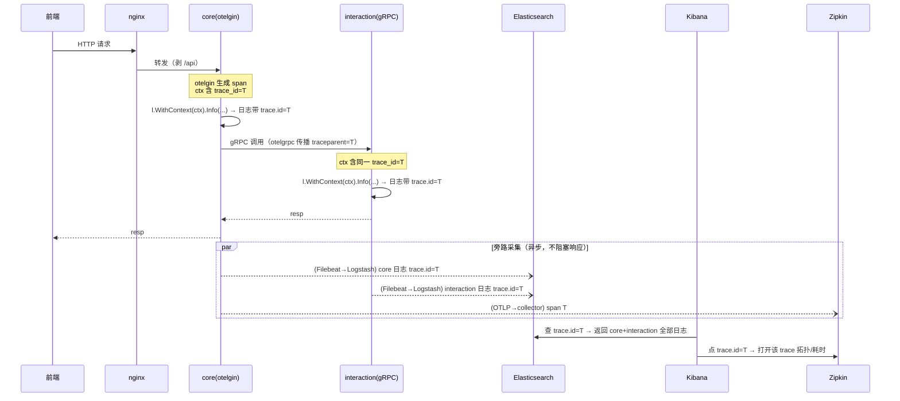

# 可观测性 · 日志与全链路关联架构设计

> 配套需求 / 选型对比 / 落地计划见同目录 `PRD.md`。本文只讲**技术架构**：组件拓扑、数据流、代码层结构、失效模式。
> 范围：补齐 **logs** 支柱（Filebeat→Logstash→ES→Kibana）+ 打通 **logs↔traces↔metrics**（`trace.id` 为唯一关联键）。
> 关键前提（事实）：traces 已生产级（OTel W3C 传播 + Zipkin），metrics 已生产级（Prometheus），**本方案不重做二者**。

## 0. 组件拓扑与职责边界（事实推导，非臆测）

```
                          ┌─────────────────── 应用容器（9 服务，stdout 结构化 JSON）───────────────────┐
 前端 → nginx ──HTTP──▶   │  webook-core:8010(otelgin) ──gRPC(etcd 发现,otelgrpc)──▶ interaction/comment/…  │
 (nginx JSON access log)  │        │ Zap(LoggerX)                                        │ Zap(LoggerX)        │
                          │        ├─ 业务日志 / access log(中间件) / gRPC 日志(拦截器)  ├─ 业务日志/gRPC 日志 │
                          └────────┼──────────────────────────── stdout ────────────────┼─────────────────────┘
                                   ▼                                                     ▼
      ┌──────────────── 新增：日志采集链路（旁路，与业务解耦）────────────────┐   ┌──── 已有：traces / metrics ────┐
      │ Docker json-file → Filebeat → Logstash(:5044) → Elasticsearch        │   │ OTLP/gRPC → otel-collector → Zipkin │
      │                    (add_docker_metadata) (ECS规范化/降噪/脱敏) (ILM)   │   │ /metrics  → Prometheus → Grafana    │
      └──────────────────────────────────┬───────────────────────────────────┘   └───────────────┬────────────────────┘
                                          ▼                                                        │
                                       Kibana ──────────点 trace.id 跳转──────────▶ Zipkin :9411 ◀─┘
                                          └──────────── ES datasource ───────────▶ Grafana（统一告警入口）
```

**职责边界表**（谁产 / 谁采 / 谁存 / 谁看 / 谁关联）：

| 环节 | 组件 | 职责 | 事实锚点 |
|------|------|------|---------|
| 产生 | Zap `LoggerX` | 应用结构化日志（业务/access/gRPC），本方案注入 `trace.id`/`span.id`/`service.name` | `pkg/logger/types.go:10-15` |
| 产生 | nginx | 入口层 JSON access log（已就绪） | `deploy/nginx/nginx.conf:17-30` |
| 采集 | Filebeat | 读容器 `json-file` + `add_docker_metadata` + multiline 兜底 + 过滤非 `webook-*` | 新增 `deploy/elk/filebeat/` |
| 传输/加工 | Logstash | ECS 规范化 + 降噪(drop /health,/metrics) + 脱敏 + 路由 ES + 持久化队列缓冲 | 新增 `deploy/elk/logstash/` |
| 存储 | Elasticsearch | 索引/检索，复用 `webook-es`（独立索引 + ILM + 角色隔离） | `docker-compose.yaml:381-400` |
| 检索 | Kibana | Discover / Dashboard / `trace.id`→Zipkin 跳转 | 新增 `webook-kibana:5601` |
| 关联 | `trace.id` | logs↔traces↔metrics 的唯一 join 键 | 本方案核心 |
| 告警 | Grafana | 加 ES datasource，日志告警与 up/5xx/P99 同入口 | `deploy/grafana/provisioning/` |

**为什么 core 是唯一 HTTP 入口**：nginx 仅路由 core/chat/migrator（`default.conf`），6 个纯 gRPC 服务经 core BFF + etcd 发现调用——所以一次前端请求的日志天然散落在「core + N 个下游 gRPC 服务」，**跨服务缝合只能靠 `trace.id`**（§1）。

---

## 1. 三支柱关联架构【核心】

### 1.1 `trace.id` 作为唯一关联键

现状：trace context 已在每个请求的 `ctx` 里（otelgin 入口生成 → otelgrpc/saramax 跨服务传播）。缺的是**日志侧没把它取出来写进去**。本方案在 `LoggerX` 实现层从 `ctx` 取 `SpanContext` 注入日志，使：

- **同一 trace 的所有日志**（跨 core 与所有下游服务）带**相同 `trace.id`** → Kibana 一次查询捞全链路日志。
- **每条日志的 `span.id`** 标记它属于链路的哪一段 → 精确到具体服务/阶段。
- **`trace.id` 是三系统共有字段** → Kibana(logs)、Zipkin(traces)、Grafana(metrics exemplar 演进) 互跳。

### 1.2 一次跨服务请求的日志关联时序



### 1.3 关联入口矩阵

| 从 | 到 | 关联方式 |
|----|----|---------|
| Kibana 日志 | Zipkin 链路 | `trace.id` 字段 Url formatter → `:9411/zipkin/traces/{id}` |
| Zipkin 慢 span | Kibana 日志 | 复制 traceId → Kibana 查 `trace.id:` |
| Grafana 指标异常 | Kibana/Zipkin | 告警面板下钻（演进：histogram exemplar 挂 `trace_id`，见 PRD §16） |
| Grafana 告警 | ES 日志 | ES datasource 直接在 Grafana 查日志（统一入口） |

---

## 2. 应用侧日志架构（代码层）

### 2.1 `LoggerX` 分层与 ctx 注入机制

**注入点选在实现层 `ZapLogger.toArgs`**（而非每个调用点手写 trace_id）——单一注入点，调用点只需 `WithContext(ctx)` 绑定即自动获益：

```
调用点                       LoggerX(绑定 ctx 的副本)    ZapLogger.toArgs（注入点）         zap.Logger
l.WithContext(ctx).Info(  →  WithContext 返回带 z.ctx  →  1. z.ctx != nil ?              →  JSON 输出
  "msg", f...)                的 *ZapLogger 浅拷贝          2. SpanContextFromContext(z.ctx)   {@timestamp, log.level,
                                                          3. 有效则加 trace.id/span.id       message, trace.id,
                                                          4. 追加业务 Field                  span.id, service.name...}
```

- **取值来源**：`go.opentelemetry.io/otel/trace.SpanContextFromContext(z.ctx)`；`z.ctx==nil`（base logger）或无有效 span 时跳过 → **全场景安全，不 panic、base logger 行为不变**。
- **依赖**：otelgin 的 `ContextWithFallback=true`（`internal/ioc/web.go:48` 已设）保证 gin ctx 能取到 span；gRPC 侧 otelgrpc StatsHandler 已把 span 放进 handler ctx。
- **为什么 `WithContext` 增量而非改方法签名**：改 4 方法签名会让 9 模块同时编译失败（Go 无重载）、无法逐模块灰度；`WithContext(ctx)` 增量新增、旧方法不动 → 可真·逐模块迁移。返回**浅拷贝**（共享底层 `*zap.Logger`、仅多带 ctx）不改注入的共享单例 → 规避并发 data race + trace 串号（语义同 zap `.With()`/slog `.With()`）。

### 2.2 日志产生源拓扑：四源归一

应用侧日志有四个产生源，本方案统一都经 `LoggerX(ctx)` → 都自动带 `trace.id`：

| 源 | 位置 | 现状 | 改造 |
|----|------|------|------|
| 业务日志 | handler/service/repository 手写 `l.Xxx(...)` | 无 ctx | 改 `l.WithContext(ctx).Xxx(...)`（2.4） |
| HTTP access log | `accesslog` 中间件 `loggerFunc(ctx, RequestLog)` | 用 `l.Debug`（prod 被吞）+ 无 trace.id | 提 `l.WithContext(ctx).Info(...)` + ECS 字段（PRD §7.4） |
| gRPC 请求日志 | `interceptor/logging` builder | 已实现**但未接线** | 接进拦截链 + `l.WithContext(ctx).Info(...)`（PRD §7.5） |
| gRPC 错误日志 | `interceptor/errconv` | 已接线，`l.Error(...)` 无 ctx | 改 `l.WithContext(ctx).Error(...)` |

> `accesslog.Build()` 的回调本就持 `ctx`（`builder.go:98` `b.loggerFunc(ctx, rl)`），改造零成本拿到 trace.id。

### 2.3 EncoderConfig + service 字段：单一真相源

现状 9 份 `ioc/logger.go` 逐字节重复（`InitLogger` 只覆盖 `cfg.Encoding` 未固定 `EncoderConfig` → dev/prod schema 漂移，差距 D3）。架构改造：**下沉到 `pkg/logger`，ioc 只调用**。

```
pkg/logger/zap_config.go (新增)          各 ioc/logger.go (9 份, 收敛)
  EcsEncoderConfig() ──────────────────▶  cfg.EncoderConfig = logger.EcsEncoderConfig()
  (固定 ECS 键 + epoch_millis)             l = l.With(service.name/version/environment)  ← 读 otel 段
```

- ECS 键 + `EpochMillisTimeEncoder` → dev/prod 统一 schema，且时间戳对齐项目 int64 毫秒约定（coding-rules §5）。
- `service.*` 复用现有 `otel.service_name/env/service_version` 配置，**不新增配置项**。

### 2.4 调用点迁移的结构影响（ctx 从哪来）

迁移 = 调用点加 `.WithContext(ctx)`（旧方法保留，逐模块增量）。ctx 在各层本就现成，机械替换：

| 层 | ctx 来源 |
|----|---------|
| web handler | `*gin.Context`（实现 `context.Context`，经 ContextWithFallback 带 span） |
| service | 方法首参 `ctx context.Context`（业务方法签名固定带） |
| repository/dao | 方法首参 `ctx`（GORM/Redis 调用本就传 ctx） |
| 拦截器/中间件 | 框架回调持有 ctx |
| init/main（无 ctx） | `context.Background()`（无 span，注入跳过，安全） |

风险点：`internal/repository/article_author.go:113,119`、`user.go:48,73` 用**全局 `zap.L()`** 绕过注入（差距 D6）→ 一并改注入 `LoggerX` + ctx。迁移按服务灰度、`mockgen` 重生成、逐服务 `make verify`（PRD §18 Phase 0）。

---

## 3. 采集管道架构（Filebeat → Logstash → ES）

### 3.1 为什么 Logstash 在中间（三段职责分离）

```
Filebeat（每宿主机，轻）      Logstash（集中，重加工）           Elasticsearch（存）
─ 读 docker json-file        ─ beats input :5044               ─ bulk 写入
─ add_docker_metadata        ─ json 解析 app message           ─ index template + ILM
─ multiline 兜底非 JSON      ─ ECS 规范化 / 降噪 / 脱敏         ─ 别名 rollover
─ 只采 webook-* 容器         ─ 持久化队列（抗 ES 抖动）
─ output → logstash          ─ output → es
```

- **职责分离理由**：Filebeat 只做"贴近数据源的轻采集"（每机部署，资源敏感）；Logstash 做"集中式重加工 + 缓冲解耦"（多源汇聚：app + nginx + 未来审计日志统一规范化）。
- **缓冲用 Logstash 持久化队列**（`queue.type: persisted`）而非引入 Kafka（对齐 PRD 非目标，避免为日志再拉一套中间件）。

### 3.2 数据形态流转（双层 JSON 拆解）

```
容器内: Zap 输出 {"@timestamp":..,"message":..,"trace.id":..}   ← app 层 JSON（一行）
   ↓ Docker json-file 包一层
磁盘:  {"log":"{\"@timestamp\":..}", "stream":"stdout", "time":..}  ← docker 层 JSON
   ↓ Filebeat container input 解 docker 层 + add_docker_metadata
Filebeat 事件: { message: "{app JSON 字符串}", container:{name,image}, host:{name} }
   ↓ Logstash json{ source=>message } 解 app 层
ES 文档: { @timestamp, log.level, message, trace.id, span.id, service.name, container.name, ... }  ← 扁平 ECS
```

> 结构化 JSON 让"栈信息在字段内"，**无需 multiline**；multiline 仅兜底裸 panic 等非 JSON 行。

### 3.3 旁路设计（关键：采集链路与业务解耦）

- 应用只管写 stdout，**不感知采集链路存在**。Filebeat→Logstash→ES 是**旁路**，任一环节挂掉只丢/延迟日志采集，**不阻塞、不拖垮业务请求**。
- `LoggerX` 注入 trace.id 用 `SpanContextFromContext`，无 span 也不报错 → **可观测性组件的失效不传导到业务**（前瞻·可用性）。

---

## 4. 存储架构（ES 复用 + 隔离）

### 4.1 索引 / 别名 / ILM 拓扑

```
写别名 webook-logs-{env}-write ──▶ 后备索引 webook-logs-{env}-000001, -000002, ...（ILM rollover 递增）
                                        │
    ILM(webook-logs-ilm):  hot[rollover: 1d 或 5gb] ──▶ delete[dev 7d / prod 30d]
    过滤维度: service.name 字段（非每服务一索引 → 控单节点 shard 数）
    单节点: number_of_shards=1, number_of_replicas=0
```

### 4.2 复用 `webook-es` 的隔离设计（三重隔离）

复用现有单节点 ES（省 ~2GB），靠三重隔离避免与 `article_v1` 检索互扰：

| 隔离维度 | 手段 |
|---------|------|
| 数据隔离 | 独立索引 `webook-logs-*`（别名 + 版本化，遵项目 ES 规范）+ ILM 自动过期 |
| 权限隔离 | 专用角色：`logstash_writer`（仅 `webook-logs-*` 写 + ILM）/ `kibana_reader`（只读）/ `kibana_system`；替换 `elastic/elastic` 弱口令 |
| 资源隔离 | ES 堆上调（dev 384m→768m / prod 1024m→1536m）吸收日志写入；量大再拆独立实例（演进） |

### 4.3 字段爆炸防护

`dynamic_templates` 把未知字符串字段统一映射 `keyword` + `ignore_above:1024`，已知字段（trace.id/service.name/http.*/event.duration）显式定型 → 防 dynamic mapping 失控 + 超长串撑爆索引。

---

## 5. 关键技术决策

| # | 决策 | 选择 | 理由 |
|---|------|------|------|
| 1 | trace_id 注入位置 | 实现层 `ZapLogger.toArgs` 读 `z.ctx` 单点注入 | 全应用零散调用点自动获益，不逐处手写 |
| 2 | 接口改造方式 | 增量加 `WithContext(ctx) LoggerX`（旧方法不动，返回浅拷贝） | 改签名会让 9 模块同时编译失败(Go 无重载)、无法逐模块灰度；副本规避共享单例并发串号 |
| 3 | 无 span 时行为 | `SpanContextFromContext` 无效则跳过 | 全场景安全，可观测组件失效不传导业务 |
| 4 | 日志 schema | ECS + `epoch_millis` | 业界标准 + 对齐项目 int64ms 时间约定 |
| 5 | EncoderConfig | 下沉 `pkg/logger` 单一真相源 | 消除 9 份 ioc 重复，修 dev/prod 漂移(D3) |
| 6 | 采集器 | Filebeat（非直连）→ Logstash | 轻采集 + 集中重加工/缓冲解耦分离 |
| 7 | 日志缓冲 | Logstash 持久化队列（非 Kafka） | 不为日志再引一套中间件（KISS） |
| 8 | ES 实例 | 复用 `webook-es` + 三重隔离 | 单机内存吃紧，省 ~2GB；隔离保护检索 |
| 9 | 索引粒度 | 每环境一索引 + service 字段过滤 | 控单节点 shard 数（非每服务一索引） |
| 10 | 告警入口 | 统一进 Grafana（加 ES datasource） | 避免 Kibana/Grafana 两套告警系统 |
| 11 | 链路后端 | 保持 Zipkin（不换 Elastic APM） | 已生产级，避免重复基建 |

---

## 6. 失效模式与降级架构

| 失效环节 | 影响 | 降级 / 缓解 |
|---------|------|------------|
| Filebeat 挂 | 该宿主机日志暂停采集 | registry 断点续采，恢复后补采；不影响业务 |
| Logstash 挂 | 采集管道中断 | 持久化队列缓冲；Filebeat 侧背压重试；不影响业务 |
| ES 不可达 | 日志无法写入/检索 | Logstash 队列暂存；ES 恢复后回放；**检索业务(search)受同实例影响** → 见资源隔离 |
| ES 磁盘满 | 写入拒绝 | ILM 过期兜底 + 监控 ES 磁盘水位告警（runbook） |
| trace 无 span | 日志无 trace.id | 注入跳过，日志仍正常产出（安全） |
| 内存超限 OOM | 容器 exit137 | `mem_limit` 兜底 + dev 先行灰度 + prod 上线前核物理内存 |
| 日志含敏感信息 | PII/token 入 ES | app 不打 + Logstash `gsub` 脱敏两道防线 |

**旁路原则贯穿全局**：采集/存储/可视化任一失效，最坏只影响"看日志"，不影响"跑业务"——唯一例外是 ES 实例与 search 检索共用（资源隔离缓解，量大拆实例根治）。

---

## 7. 部署拓扑与资源

| 服务 | 镜像(=9.3.2) | 端口 | 网络 | mem_limit(dev/prod) | 依赖 |
|------|------|------|------|------|------|
| webook-filebeat | elastic/filebeat | — | 默认 bridge + 挂 docker sock/containers:ro | 128m/256m | logstash |
| webook-logstash | elastic/logstash | 5044/9600 | 默认 bridge | 1024m/1536m(heap 512m/1g) | es |
| webook-kibana | kibana | 5601(dev 暴露/prod 内网白名单) | 默认 bridge | 1024m/1024m | es |
| webook-es(复用) | elasticsearch | 9200 | 默认 bridge | 堆上调 | — |

- **端口不冲突**：5601/5044/9600 空闲，不侵占业务 `80xx`/otel `88xx`/exporter `9xxx` 段（CLAUDE.md 端口铁律）。
- **网络**：沿用 compose 默认 bridge（`webook-<env>_default`），container_name 互通，ELK 不额外开公网端口（除 dev Kibana）。
- **内存增量 ≈ +2.7GB**（复用 ES 方案），单机 prod 已占 ~12.7GB → 见失效模式 OOM 行 + PRD §17 R1。

---

## 8. 风险（架构层）

架构级失效已见 §6；完整风险清单（含实施/资源/回归）见 **PRD §17**。此处只强调架构决策直接引入的两条：

| 风险 | 根因 | 缓解 |
|------|------|------|
| ES 实例复用耦合 | 日志与检索共单节点（决策 8） | 三重隔离；量大拆独立实例根治 |
| LoggerX 接口改动面大 | 加 `WithContext`（决策 2）后需逐服务迁调用点 | 增量非破坏（旧方法保留）+ 单点注入 + 分服务灰度 + 逐服务 verify；无 mock 需重生成；无 span 安全 |

---

## 9. 与 PRD 的关系 / 落地入口

- **本文（ARCHITECTURE）**：技术架构——拓扑、数据流、代码层结构、失效模式、决策。
- **PRD.md**：需求、四方案选型对比、trace_id 好处/必要性专章、字段规范、逐环节配置、**分 4 阶段任务拆分（§18）**、验收标准（§19）。
- **落地顺序**：从 PRD §18 **Phase 0（应用侧日志标准化）** 起步——与 ELK 部署解耦、独立有价值、是 trace_id 关联前提。走 `workflow:tdd`。
