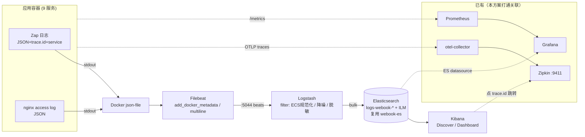

# 可观测性 · 日志体系标准化与 ELK 接入方案

> 模块：`observability`（日志支柱 + logs↔traces 关联）
> 状态：**设计待评审**（Gate 1 未通过前不动代码）
> 关联：traces → Zipkin（已落地）· metrics → Prometheus/Grafana（已落地）· 本方案补齐 **logs** 支柱并打通三支柱

---

## 0. 决策摘要（TL;DR）

| 决策项 | 结论 | 一句话理由 |
|--------|------|-----------|
| 采集栈 | **标准 ELK**：Filebeat → Logstash → Elasticsearch → Kibana | 用户明确要 ELK；教科书级、Kibana 全文检索强、可学习价值高 |
| trace_id 注入 | **改 `LoggerX` 接口加 `context.Context`**，从 ctx 自动注入 `trace.id`/`span.id` | 一劳永逸、业务日志全带、最标准化 |
| ES 实例 | **复用现有 `webook-es`（独立索引 + ILM + 独立 role）**，量大再拆独立实例 | 单机内存吃紧，复用省 ~2GB；靠索引/ILM/角色隔离 |
| 日志 schema | **ECS 对齐**（`@timestamp` 用 `epoch_millis` 对齐项目 int64ms 约定） | 业界标准 + 与项目时间戳规范天然一致 |
| 告警入口 | **接进现有 Grafana**（加 ES datasource），不用 Kibana 自己那套 | 告警单一入口，避免两套 |

**核心洞察**：本项目 **traces（链路追踪）已生产级落地**——OTel W3C `traceparent` 已跨 HTTP/gRPC/Kafka/Redis/GORM 全传播、Zipkin 可视化。你想加的"trace-id 全链路监控"**基建已经有了**，真正缺的是 **① 日志没被采集进可检索存储（ELK 这部分）+ ② 已有的 trace_id 没进日志（logs 与 traces 割裂）**。本方案把这两件事一起做完。

---

## 1. 背景：三支柱现状与差距

可观测性三支柱（logs / metrics / traces）在本项目的真实覆盖：

| 支柱 | 现状 | 技术栈 | 缺口 |
|------|------|--------|------|
| **Traces** | ✅ 生产级 | OTel SDK → OTLP/gRPC → otel-collector → Zipkin，`ParentBased(TraceIDRatioBased)` 采样（prod 0.1），W3C TraceContext+Baggage 传播，跨 HTTP(otelgin)/gRPC(otelgrpc)/Kafka(saramax)/Redis(redisotel)/GORM(otel plugin) | ES/etcd/LLM 三类外呼未埋点（次要） |
| **Metrics** | ✅ 生产级 | Prometheus `client_golang`，`webook_http_*`/`webook_grpc_*`/`webook_db_*` + 4 exporter + Grafana 9 看板 + 告警 provisioning | — |
| **Logs** | ⚠️ **只到 stdout 就断了** | Zap → stdout（无采集、无存储、无检索、**无 trace_id**、无 service 字段） | 全部 |

**差距清单（侦察实证，均带文件锚点）**：

| # | 差距 | 证据 | 影响 |
|---|------|------|------|
| D1 | 日志**无任何关联 ID**（trace/span/request） | `pkg/logger/types.go:10-15` `LoggerX` 方法签名无 `ctx`，结构上取不到 | logs 与 traces 无法关联，跨服务排障靠猜 |
| D2 | 日志**无 `service` 字段** | `internal/ioc/logger.go:15-56` 无 `.With(...)` | ELK 里区分服务只能靠容器元数据 |
| D3 | **dev 与 prod 的 JSON schema 不一致** | `ioc/logger.go:39-41` 只覆盖 `cfg.Encoding`、未固定 `EncoderConfig`；dev 用 Development 预设（key `L/T/C/M/S`、ISO8601），prod 用 Production 预设（key `level/ts/caller/msg`、epoch 秒） | 同一条日志字段名/时间格式跨环境不同，ES mapping 冲突 |
| D4 | **access log 在 prod 被吞** | 三处均 `l.Debug("HTTP request", ...)`（`internal/ioc/web.go:121-134` 等），而 staging/prod `level=info` | 生产环境几乎没有请求级日志 |
| D5 | **gRPC 无成功请求日志** | `pkg/grpcx/interceptor/logging/builder.go` 写好但**全项目无 ioc 引用**（未接线）；实际只有 `errconv` 在非业务错误时打日志 | 6 个纯 gRPC 服务请求级可观测性缺失 |
| D6 | 少数 `zap.L()` 绕过注入 logger | `internal/repository/article_author.go:113,119`、`user.go:48,73` | 绕过统一 schema，字段不受控 |
| D7 | 容器**无日志采集/轮转** | `deploy/docker-compose.yaml` 应用服务无 `logging:` 段，Docker 默认 `json-file` 未设 `max-size` | 日志只能 `docker logs`，无集中检索，磁盘可能撑满 |

> 现成伏笔：`deploy/nginx/nginx.conf:17` 注释「日志（JSON，方便后续接入 **Loki/ELK**）」，nginx access log 已是结构化 JSON 到 stdout——采集器可零改造消费。

---

## 2. 目标与非目标

**目标**
1. 应用日志集中采集、可检索、可视化（ELK）。
2. 每条日志带 `trace.id`/`span.id`/`service.name`，实现 **logs↔traces 双向关联**（Kibana ↔ Zipkin）。
3. 统一日志字段规范（ECS 对齐）+ 分级规范 + 敏感脱敏，跨 9 服务一致。
4. 修复 D3/D4/D5/D6 一致性问题。
5. 日志保留/滚动策略（ILM），控制单机磁盘与内存。

**非目标（本期不做，避免过度设计）**
- 不重做链路追踪（已生产级）。
- 不引入 OTel logs SDK / OTLP logs 管道（列为演进方向，见 §16）。
- 不换 Zipkin 为 Elastic APM。
- 不做多节点 ES 集群 / 冷热分层（单机学习环境，量大再演进）。
- 不引入 Kafka 作日志缓冲（Logstash 持久化队列足够，见 §10）。

---

## 3. 技术选型：为什么 ELK，同类方案对比

四条等价路线（均能补齐 logs 支柱），对比后**采用标准 ELK**（用户决策）：

| 维度 | ①标准 ELK（**采用**）<br>Filebeat→Logstash→ES→Kibana | ②EFK 精简<br>Fluent Bit→ES→Kibana | ③Loki<br>Fluent Bit→Loki→Grafana | ④OTel 原生<br>zap→OTLP→collector→ES |
|------|------|------|------|------|
| 全文检索 | ★★★ 倒排索引最强 | ★★★ 同 ES | ★ 仅 label 索引，LogQL 类 grep | ★★★ 同 ES |
| 资源占用 | ★（Logstash ~1GB + Kibana ~1GB） | ★★（Fluent Bit ~30MB） | ★★★ 最省 | ★★（复用 collector） |
| 与现有栈融合 | 新增 Kibana UI（与 Grafana 并存） | 同左 | ★★★ 复用 Grafana，无新 UI | ★★★ 采集面最统一 |
| trace↔log 关联 | Kibana↔Zipkin 手动跳转（本方案打通） | 同左 | Grafana 原生 trace→log | OTel 原生带入 |
| 解析/富化能力 | ★★★ Logstash 最强 | ★★ Fluent Bit filter | ★★ | ★★ collector processor |
| 成熟度/学习价值 | ★★★ 业界最正统、简历向 | ★★ | ★★ | ★（Go OTel logs SDK 较新） |
| 单机压力 | 最大 | 中 | 最小 | 中 |

**为什么采用 ①标准 ELK**
- 用户明确诉求"接入 ELK"，且要掌握正统 Elastic Stack。
- Logstash 提供**多源汇聚 + 重解析 + 降噪 + ECS 规范化 + 持久化缓冲**的解耦层，是本项目"标准化"目标的天然载体（app 日志 + nginx 日志 + 未来审计日志统一进 Logstash）。
- Kibana 全文检索 + Discover + Lens 看板，对日志排障体验最好。

**采用它要接受的代价（诚实列出）**
- Logstash（JVM）单独吃 ~1GB、Kibana ~1GB，单机 prod 已占 ~12.7GB，内存压力最大 → 用 §13 的分环境灰度 + `mem_limit` 兜底。
- 多一个 Kibana UI 与 Grafana 并存 → 用"**告警统一进 Grafana**"（§12）缓解运维分裂。

> 若后续内存告急，最平滑的降级是 ①→② (去掉 Logstash，Fluent Bit + ES ingest pipeline 承接解析)；再省则 →③ Loki。本方案的 app 侧改造（§7）与采集栈解耦，换栈不影响应用代码。

---

## 4. 整体架构



**数据流一句话**：应用/nginx 结构化 JSON 日志 → Docker stdout → Filebeat 采集富化 → Logstash 规范化降噪 → Elasticsearch 存储（ILM 滚动）→ Kibana 检索。日志里的 `trace.id` 是跨 Kibana / Zipkin / Grafana 的关联键。

---

## 5. 要安装的服务清单（技术栈 + 版本 + 资源）

版本对齐现有 ES `9.3.2`，Elastic Stack **同版本号必须一致**（Filebeat/Logstash/Kibana/ES 同为 `9.3.2`，跨大版本不兼容）。

| 服务 | 镜像 | 端口 | 角色 | mem_limit (dev/prod) | 依赖 |
|------|------|------|------|------|------|
| **Filebeat** | `elastic/filebeat:9.3.2` | 无（挂 `/var/lib/docker/containers:ro`） | 采集容器 stdout | 128m / 256m | logstash |
| **Logstash** | `elastic/logstash:9.3.2` | 5044(beats) / 9600(monitor) | 解析/富化/降噪/缓冲 | 1024m / 1536m（heap 512m/1g） | es |
| **Elasticsearch** | `elasticsearch:9.3.2`（**复用现有 `webook-es`**） | 9200 | 存储/检索 | 需上调堆：dev 384m→768m / prod 1024m→1536m | — |
| **Kibana** | `kibana:9.3.2` | 5601 | 可视化 | 1024m / 1024m | es |

**端口不冲突核对**（CLAUDE.md 端口铁律）：5601/5044/9600 均空闲；ES 9200 已占用（复用）。ELK 端口不侵占业务 `80xx` 段、otel `88xx` 段、exporter `9xxx` 段。

**新增内存增量**（复用 ES 方案）：Filebeat 128m + Logstash 1024m + Kibana 1024m + ES 堆上调 ~512m ≈ **+2.7GB**。dev 先行，prod 上线前核对宿主物理内存余量（见 §13 风险）。

---

## 6. 日志字段规范（app↔ELK 契约，ECS 对齐）

这是"接口"层——**应用输出的日志字段 = 与 ELK 的契约**。采用 **ECS（Elastic Common Schema）** 命名，字段一律扁平点分键（ES 摄入时自动转嵌套对象）。

| ECS 字段 | 类型 | 来源 | 说明 |
|----------|------|------|------|
| `@timestamp` | date(`epoch_millis`) | zap EncodeTime | **对齐项目 int64 毫秒约定**（coding-rules §5） |
| `log.level` | keyword | zap | info/warn/error/debug（统一小写） |
| `message` | text | zap msg | 日志正文，全文可搜 |
| `log.origin` | keyword | zap caller | 文件:行 |
| `service.name` | keyword | `.With()` 注入 | 取 `otel.service_name`（webook-core…） |
| `service.environment` | keyword | `.With()` 注入 | 取 `otel.env`（local/dev/staging/prod） |
| `service.version` | keyword | `.With()` 注入 | 取 `otel.service_version` |
| **`trace.id`** | keyword | **ctx 注入（本方案核心）** | W3C TraceID，关联 Zipkin |
| **`span.id`** | keyword | **ctx 注入** | 当前 SpanID |
| `error` | text | `logger.Error(err)` | 错误信息（err.Error() 串，含 code/cause）|
| `stack_trace` | text | zap StacktraceKey | error 级栈（独立顶层字段，不放 error.* 以免与标量 error 撞成 400）|
| `container.*`/`host.name` | keyword | Filebeat `add_docker_metadata` | 容器/主机元数据 |
| 业务字段 `uid`/`biz`/`biz_id`… | long/keyword | 调用点手传 | 按需，dynamic 模板控爆炸（§9） |
| access log：`http.request.method`/`url.path`/`http.response.status_code`/`event.duration`/`client.ip`/`user_agent.original` | 见 §7.4 | access log 中间件 | 请求级 |

**分级规范**（统一心智，减少噪音）：
- `Error`：需人工介入的失败（写失败、依赖不可用、panic、未预期错误）。必带 `error.message` + 业务上下文（谁/对什么/做了什么）。
- `Warn`：可自动恢复的异常（降级触发、重试、限流命中、缓存 miss 回源失败但已兜底）。
- `Info`：关键业务动作（写操作成功、状态变更、access log、gRPC 请求）。
- `Debug`：仅 local/dev；细粒度排障。**禁止**在 Info 级打高频循环日志。

---

## 7. 应用侧改造（日志标准化 6 项）

> 与 ELK 部署**解耦**：本节改动即使不接 ELK 也独立有价值（修 D1~D6），应作为 **Phase 0 先行**。

### 7.1 `LoggerX` 加 `WithContext` + trace_id 注入【核心】

**增量、非破坏**：保留原 4 方法不动（未迁移模块零影响），接口仅新增 `WithContext`。

**接口**（`pkg/logger/types.go`）：
```go
type LoggerX interface {
	Debug(msg string, args ...Field)
	Info(msg string, args ...Field)
	Warn(msg string, args ...Field)
	Error(msg string, args ...Field)
	// WithContext 绑定 ctx，返回同类型 logger（其日志自动注入 trace.id/span.id）
	WithContext(ctx context.Context) LoggerX
}
```

**实现**（`pkg/logger/zap_logger.go`）——`ZapLogger` 加 `ctx` 字段；`WithContext` 返回**浅拷贝**（并发安全，不改共享单例），`toArgs` 从 `z.ctx` 注入：
```go
type ZapLogger struct {
	l   *zap.Logger
	ctx context.Context // WithContext 绑定；nil = 未绑定（不注入）
}

// 返回副本而非 z.ctx=ctx —— logger 是注入的共享单例，就地改会 data race + trace 串号
func (z *ZapLogger) WithContext(ctx context.Context) LoggerX {
	return &ZapLogger{l: z.l, ctx: ctx}
}

func (z *ZapLogger) toArgs(args []Field) []zap.Field {
	fields := make([]zap.Field, 0, len(args)+2)
	if z.ctx != nil {
		if sc := trace.SpanContextFromContext(z.ctx); sc.IsValid() { // 无 span 跳过
			fields = append(fields,
				zap.String("trace.id", sc.TraceID().String()),
				zap.String("span.id", sc.SpanID().String()))
		}
	}
	for _, arg := range args {
		fields = append(fields, zap.Any(arg.Key, arg.Val))
	}
	return fields
}
```
- `z.ctx == nil`（base logger / init）或无有效 span → 跳过注入 → **全场景安全**，base logger 行为不变。
- `NopLogger` 及测试假 logger 同步加 `WithContext` 返回自身（`return n`/`return r`）。
- 依赖 otelgin 的 `ContextWithFallback=true`（`internal/ioc/web.go:48` 已设）保证 gin ctx 能取到 span。

**迁移**（机械、可逐模块增量）：
- 调用点 `l.Error("msg", f...)` → `l.WithContext(ctx).Error("msg", f...)`。ctx 在 handler(gin ctx)/service/repository(方法首参) 基本都现成。
- `errconv` 拦截器、`pkg/ginx` 的 `Wrap/WrapReq` 同理传各自 ctx。
- **无需 mockgen**：`LoggerX` 无 mock，实现仅 `ZapLogger`/`NopLogger` + 3 个测试假 logger（cronx/errconv/logging）。
- **逐服务灰度**：✅ **tag 已落地**（4 处 `WithContext`，pkg/logger 5 用例 + `make verify` 全绿）→ 逐服务 core/chat/comment/interaction/relation/search/worker/migrator，每服务改完即 `make verify`。

### 7.2 固定 `EncoderConfig`（统一 dev/prod schema，修 D3）

把 EncoderConfig 从"dev/prod 预设"改成**显式固定 ECS 键**，抽到 `pkg/logger` 避免 9 份 `ioc/logger.go` 重复（复用原则）。新增 `pkg/logger` 构造器：
```go
// pkg/logger/zap_config.go（新增，供各 ioc 调用，消除 9 份重复）
func EcsEncoderConfig() zapcore.EncoderConfig {
	return zapcore.EncoderConfig{
		TimeKey: "@timestamp", LevelKey: "log.level", MessageKey: "message",
		CallerKey: "log.origin", StacktraceKey: "stack_trace", NameKey: "log.logger",
		LineEnding:   zapcore.DefaultLineEnding,
		EncodeLevel:  zapcore.LowercaseLevelEncoder,
		EncodeTime:   zapcore.EpochMillisTimeEncoder, // 对齐项目 int64 毫秒
		EncodeCaller: zapcore.ShortCallerEncoder,
	}
}
```
各 `ioc/logger.go` 在 `cfg.Build()` 前：`cfg.EncoderConfig = logger.EcsEncoderConfig()`。local 仍可 `encoding: console` 保留彩色；dev/staging/prod 统一 `json` + 上述固定键。

### 7.3 注入 `service` 字段（修 D2）

`ioc/logger.go` 在 build 后 `.With` 附服务身份（复用现有 `otel` 配置段，不新增配置）：
```go
var oc struct{ ServiceName, ServiceVersion, Env string }
_ = viper.UnmarshalKey("otel", &oc) // 复用 otel.service_name/service_version/env
l = l.With(
	zap.String("service.name", oc.ServiceName),
	zap.String("service.version", oc.ServiceVersion),
	zap.String("service.environment", oc.Env),
)
```

### 7.4 access log 提到 Info 级 + 补 trace_id（修 D4）

- `internal/ioc/web.go`（+chat/migrator 各自 ioc）的 `loggerMiddleware`：`l.Debug("HTTP request", ...)` → `l.WithContext(ctx).Info("HTTP request", ...)`，prod 可见。
- `RequestLog`（`pkg/ginx/middleware/accesslog/builder.go:133-143`）字段改 ECS 命名并入库：`http.request.method`/`url.path`/`http.response.status_code`/`event.duration`(ms)/`client.ip`/`user_agent.original`。`trace.id` 由 7.1 的 `l.WithContext(ctx).Info(...)` 自动带（回调已持 `ctx`）。
- 降噪：`/health`、`/metrics` 路径不打 access log（在 Logstash drop 亦可，见 §10）。

### 7.5 gRPC logging 拦截器接线 + trace_id（修 D5）

- `pkg/grpcx/interceptor/logging/builder.go` 已实现，**接进 6 个纯 gRPC 服务的拦截链**（interaction/comment/relation/tag/search + core 的 server/client），插在 `metrics` 之后、`errconv` 之前。
- 拦截器内 `b.l.Info("Server RPC请求", fields...)` → `b.l.WithContext(ctx).Info(...)`，自动带 `trace.id`（gRPC ctx 经 otelgrpc StatsHandler 已注入 span）。
- 各 `ioc/grpc.go` 装配（provider set 加 `logging.NewInterceptorBuilder`）。

### 7.6 修 `zap.L()` 绕过 + 敏感脱敏（修 D6）

- `internal/repository/article_author.go:113,119`、`user.go:48,73` 的 `zap.L().Error(...)` → 注入的 `LoggerX` + `ctx`（构造函数补 `logger.LoggerX` 依赖）。
- 脱敏：access log 的 `req_body`/`res_body` 已可配长度截断；密码/token 类字段在 app 侧**不打**，兜底在 Logstash 脱敏（§10、§14）。

---

## 8. trace-id 全链路：好处与必要性分析【专章 · 回答你的核心问题】

### 8.1 澄清：你要的"全链路追踪"基建已经有了

- OTel `TracerProvider` 全服务初始化（`internal/ioc/otel.go:27` 等 9 份），W3C `TraceContext`+`Baggage` propagator，`traceparent` 已跨 **HTTP(otelgin) / gRPC(otelgrpc StatsHandler) / Kafka(saramax) / Redis(redisotel) / GORM(otel plugin)** 全程传播，Zipkin 可视化调用拓扑与耗时。
- 即：**每个请求的 ctx 里，trace_id 早就存在了**。缺的不是"追踪"，是"trace_id 没被写进日志"。

### 8.2 把 trace_id 注入日志的好处（为什么必要）

| # | 好处 | 没有 trace_id 时的痛 |
|---|------|----------------------|
| 1 | **一个 trace_id 串起一次请求跨所有服务的全部日志** | 排障靠 `grep` 时间窗 + 关键词猜，跨服务日志无法缝合 |
| 2 | **Kibana ↔ Zipkin 双向跳转**：异常 trace→Zipkin 看拓扑/慢在哪→Kibana 按 trace_id 捞该请求业务日志看细节 | logs 与 traces 两套系统各看各的，来回对时间戳 |
| 3 | **跨服务因果关联**：一次 `core → interaction/comment/relation gRPC` 的请求日志散在 4 个服务，trace_id 是唯一缝合键 | 微服务下根本无法还原一次请求的完整路径 |
| 4 | **MTTR 达标**：前瞻 checklist 明确要求"5 分钟定位根因"（§15），跨服务定位没有 trace_id 关联做不到 | 定位根因从分钟级退化到小时级 |
| 5 | **错误采样一致性**：trace 采样 prod 0.1，但错误日志应保证能回链到 trace | 采样丢弃后错误 trace 找不回 |

### 8.3 必要性判断：**必要，且是本次 ELK 接入的核心价值**

- 单纯把日志堆进 ES = "可搜索的 grep"；有了 trace_id 关联才从"日志仓库"升级为"**可观测性平台**"——三支柱闭环（metrics 发现异常 → traces 定位慢服务 → logs 看根因细节）。
- 成本可控：trace 基建已就绪，只差 `LoggerX` 接口改造这一次性工作（§7.1）。**投入产出比在整个方案里最高**。
- `span.id` 一并注入：区分同一 trace 内不同阶段/服务的日志。
- 进阶：W3C `Baggage`（propagator 已配）可携 `uid` 等业务维度贯穿链路，未来可一并注入日志（§16）。

**结论**：强烈建议加入，且作为 Phase 0 优先级最高项。它不是"锦上添花"，是让 ELK 真正有用的前提。

---

## 9. Elasticsearch 索引设计（mapping + ILM + 别名）

沿用项目 ES 规范（CLAUDE.md「ES 索引规范」）：**别名 + 版本化/滚动**，app 只认逻辑写别名。

**索引策略**：每环境一个写别名，按 `service.name` 字段过滤（而非每服务一索引，控单节点 shard 数）。
- 写别名：`logs-webook-{env}-write` → 后备索引 `logs-webook-{env}-000001`（ILM rollover 递增）
- 单节点 → `number_of_shards: 1` / `number_of_replicas: 0`

**Index Template（关键字段 + 控字段爆炸）**：
```jsonc
{
  "index_patterns": ["logs-webook-*"],
  "template": {
    "settings": { "number_of_shards": 1, "number_of_replicas": 0,
                  "index.lifecycle.name": "logs-webook-ilm",
                  "index.lifecycle.rollover_alias": "logs-webook-dev-write" },
    "mappings": {
      "dynamic": true,
      "dynamic_templates": [
        { "strings_as_keyword": { "match_mapping_type": "string",
          "mapping": { "type": "keyword", "ignore_above": 1024 } } }
      ],
      "properties": {
        "@timestamp": { "type": "date", "format": "epoch_millis" },
        "message":    { "type": "text" },
        "log.level":  { "type": "keyword" },
        "service.name": { "type": "keyword" }, "service.environment": { "type": "keyword" },
        "trace.id":   { "type": "keyword" }, "span.id": { "type": "keyword" },
        "error": { "type": "text" }, "stack_trace": { "type": "text" },
        "http.response.status_code": { "type": "short" },
        "event.duration": { "type": "long" }, "client.ip": { "type": "ip" }
      }
    }
  }
}
```
- `dynamic_templates` 把未知字符串字段统一映射 keyword + `ignore_above`，防字段爆炸/超长。

**ILM 策略**（`logs-webook-ilm`，单节点只 hot→delete）：
- hot：`rollover` 触发条件 `max_age: 1d` 或 `max_primary_shard_size: 5gb`
- delete：dev `min_age: 7d` / prod `min_age: 30d`（可配）

**管理入口**：沿用 `mk/es.mk` 风格加日志相关 target（`logs-template` / `logs-ilm` / `logs-status`），mapping json `//go:embed` 真相源可放 `deploy/elk/` 或随 es.mk（单一真相源，禁两处漂移）。

---

## 10. Logstash 管道设计

`deploy/elk/logstash/pipeline/webook.conf`：
```ruby
input { beats { port => 5044 } }

filter {
  # Filebeat 已解 docker 层；应用 message 是 JSON → 解析进顶层
  if [message] =~ /^\{/ { json { source => "message" skip_on_invalid_json => true } }

  # 降噪：健康检查/指标抓取不入库
  if [url.path] in ["/health", "/metrics"] { drop {} }

  # 时间：epoch_millis → @timestamp
  date { match => ["@timestamp", "UNIX_MS"] target => "@timestamp" }

  # 脱敏兜底：req/res body 里的 token/password 打码
  mutate { gsub => ["message", "(?i)(password|token|authorization)\"?\s*[:=]\s*\"?[^\",}\s]+", "\1:***"] }

  # 从容器名派生 service.name 兜底（app 已带则不覆盖）
  if ![service.name] and [container][name] { mutate { copy => { "[container][name]" => "service.name" } } }
}

output {
  elasticsearch {
    hosts => ["http://webook-es:9200"]
    user => "logstash_writer" password => "${ES_LOGS_PASS}"
    ilm_rollover_alias => "logs-webook-${APP_ENV_SHORT}-write"
    ilm_policy => "logs-webook-ilm"
  }
}
```
- **持久化队列**（`queue.type: persisted`）代替 Kafka 缓冲，抗 ES 短时不可用（对齐"非目标：不引入 Kafka"）。
- Logstash heap 经 `LS_JAVA_OPTS=-Xms512m -Xmx512m`（dev）控制。

---

## 11. Filebeat 采集设计

`deploy/elk/filebeat/filebeat.yml`：
```yaml
filebeat.inputs:
  - type: container
    paths: ["/var/lib/docker/containers/*/*.log"]
    # 非 JSON 行（如裸 panic）按栈聚合
    multiline: { pattern: '^\s', match: after, negate: false }

processors:
  - add_docker_metadata: ~          # 注入 container.name/image/labels
  - drop_event:                     # 只采 webook-* 容器，排除中间件噪音
      when: { not: { regexp: { container.name: "^webook-" } } }

output.logstash:
  hosts: ["webook-logstash:5044"]
```
- 挂载（compose）：`/var/lib/docker/containers:/var/lib/docker/containers:ro` + `/var/run/docker.sock:/var/run/docker.sock:ro`。
- JSON 结构化日志**无需 multiline**（栈是 JSON 字段内），multiline 仅兜底非 JSON 裸行。

---

## 12. Kibana 与联动（trace_id ↔ Zipkin）

- **Data View**：`logs-webook-*`，时间字段 `@timestamp`。
- **基础 Discover 保存查询**：按 `service.name`/`log.level:error`/`trace.id:xxx` 过滤。
- **Dashboard（Lens）**：① 各服务日志量趋势；② 错误率（`log.level:error` 占比）分服务；③ 慢请求 Top（`event.duration` 排序）；④ 最近 error 列表带 `trace.id`。
- **trace.id → Zipkin 跳转**：Kibana **Field formatter（Url）** 把 `trace.id` 渲染成链接 `http://<host>:9411/zipkin/traces/{{value}}`，Discover 里一键跳 Zipkin 看完整链路。
- **告警统一进 Grafana**（关键运维决策）：给 Grafana 加 **Elasticsearch datasource**，日志类告警（错误率突增、特定 error 出现）在 Grafana alerting 里配，与现有 up/5xx/P99 告警**同一入口**，不用 Kibana 自带 rule → 避免两套告警系统。

---

## 13. 部署与资源预算

**落点**：新增 `deploy/elk/`（filebeat/logstash/kibana 配置），compose 服务加进 `deploy/docker-compose.yaml`，风格对齐现有（`container_name: webook-*`、`mem_limit`、`healthcheck`、默认 bridge 网络、`.env.<env>` 变量）。

**docker-compose 服务定义骨架**（示意，遵现有模式）：
```yaml
  webook-logstash:
    image: elastic/logstash:9.3.2
    container_name: webook-logstash
    environment: { LS_JAVA_OPTS: "-Xms512m -Xmx512m", ES_LOGS_PASS: "${ES_LOGS_PASS}" }
    volumes: [ "./elk/logstash/pipeline:/usr/share/logstash/pipeline:ro" ]
    mem_limit: ${LOGSTASH_MEM:-1024m}
    depends_on: { webook-es: { condition: service_healthy } }
    healthcheck: { test: ["CMD","curl","-f","http://localhost:9600"], interval: 30s, retries: 5 }

  webook-kibana:
    image: kibana:9.3.2
    container_name: webook-kibana
    ports: ["5601:5601"]           # dev 暴露；prod 走 nginx 内网白名单
    environment: { ELASTICSEARCH_HOSTS: "http://webook-es:9200", ELASTICSEARCH_USERNAME: "kibana_system", ELASTICSEARCH_PASSWORD: "${KIBANA_PASS}" }
    mem_limit: ${KIBANA_MEM:-1024m}
    depends_on: { webook-es: { condition: service_healthy } }

  webook-filebeat:
    image: elastic/filebeat:9.3.2
    container_name: webook-filebeat
    user: root
    volumes:
      - "./elk/filebeat/filebeat.yml:/usr/share/filebeat/filebeat.yml:ro"
      - "/var/lib/docker/containers:/var/lib/docker/containers:ro"
      - "/var/run/docker.sock:/var/run/docker.sock:ro"
    mem_limit: ${FILEBEAT_MEM:-128m}
    depends_on: [ webook-logstash ]
```

**ES 复用调整**：`webook-es` 堆上调（dev `ES_HEAP=-Xms768m -Xmx768m`、`ES_MEM=1024m`；prod `-Xms1536m -Xmx1536m`、`ES_MEM=2560m`）。

**服务拆分 14 类同步项**（CLAUDE.md 铁律，本方案适用项）：
| 维度 | 是否适用 | 动作 |
|------|---------|------|
| Docker compose | ✅ | 加 filebeat/logstash/kibana 服务 + healthcheck + depends_on |
| 部署变量 `.env.<env>`+`.example` | ✅ | `ES_LOGS_PASS`/`KIBANA_PASS`/`*_MEM`/`ES_HEAP` |
| Nginx 反代 | ✅ | prod 加 `/kibana/` location + 内网白名单（同 `/metrics` 模式） |
| Prometheus 抓取 | ✅（可选） | Logstash `:9600`/ES exporter 加 job（纳入现有监控） |
| Grafana 数据源/看板 | ✅ | 加 ES datasource（日志告警）+ 可选日志概览看板 |
| 部署脚本 `deploy.sh` | ✅ | logs/restart 覆盖新服务名 |
| 文档 CLAUDE.md/CHANGELOG | ✅ | 记录接入方式 |
| 应用配置 5 yaml / Wire / CI / Dockerfile / Metric 命名 | ❌ | ELK 是基础设施，不涉及应用模块新增 |

**收尾自查**：`grep -rn 'logstash\|kibana\|filebeat' deploy/` 确认 compose/nginx/env/脚本一致。

---

## 14. 安全与脱敏

- **ES 弱口令**（现 `elastic/elastic`）：建专用角色最小权限——`logstash_writer`（仅 `logs-webook-*` 写 + ILM）、`kibana_reader`（只读）、`kibana_system`（Kibana 后端）；密码走 `${ENV}` 占位（`ES_LOGS_PASS`/`KIBANA_PASS`），`.env` gitignore，只 track `.example`。
- **敏感脱敏两道**：app 侧不打密码/token/PII 字段（review 把关）；Logstash `gsub` 兜底打码（§10）。access log body 默认关或截断。
- **Kibana 暴露**：dev 暴露宿主 5601；prod 只走 nginx 内网白名单（复用 `/metrics` 的 IP 白名单模式），不公网暴露。
- **网络**：沿用默认 bridge，容器间 container_name 互通，ELK 不额外开公网端口（除 dev Kibana）。

---

## 15. 前瞻设计（启用，因触及全服务 + 基础设施核心）

对照前瞻 checklist 四维度：

**可观测性（本方案主战场）**
- ✅ 关键路径结构化日志（写操作/降级/异常分支）——分级规范 §6 强制。
- ✅ 错误日志带业务上下文（uid/biz_id + trace.id），非只有"系统错误"。
- ✅ 可量化指标——复用现有 Prometheus；日志派生指标接 Grafana。

**可用性**
- ✅ ELK 挂了不影响主业务：日志走 stdout，采集链路（Filebeat→Logstash→ES）是**旁路**，断了只丢日志采集、不阻塞应用。
- ✅ Logstash 持久化队列抗 ES 短时抖动；Filebeat 断点续采（registry）。
- ✅ `SpanContextFromContext` 无 span 安全跳过，logger 不因 trace 缺失报错。

**扩展性**
- ⚠ 加新**业务**服务需把容器名加进 Filebeat 白名单（`filebeat.yml` 的 `container.name` 正则）——为控日志量只采业务服务、不通配全部 `webook-*`（中间件/ELK 自身不入 ELK）。
- ✅ 索引按 `service.name` 字段区分，加服务不加索引（控 shard）。

**容量/成本演进**
- 日志量增长 → ILM 滚动 + 过期兜底磁盘；量再大 → 拆独立 logs ES 实例 / 上多节点 / 冷热分层 / 快照到对象存储。
- K8s 演进 → Filebeat 换 DaemonSet，其余不变（采集契约稳定）。

---

## 16. 发散 / 进阶想法（可选，非本期）

1. **Exemplars**：Prometheus histogram 挂 `trace_id` exemplar，Grafana 图上直接点样本跳 Zipkin——打通 metrics→traces。
2. **OTel logs 统一管道**（前述方案④）：未来 `zap→OTLP logs→otel-collector→ES`，logs/traces/metrics 同源同采集面，`trace.id` 原生带入，去掉 Filebeat/Logstash。**最优雅的终态**，等 Go OTel logs SDK 更成熟再上。
3. **Baggage 注入日志**：把 `uid`/`tenant` 经 W3C Baggage 贯穿链路并入日志，跨服务按用户维度聚合排障。
4. **日志派生 SLO**：错误率/慢请求率从日志聚合成 SLO 面板 + burn-rate 告警。
5. **审计日志独立索引**：登录/权限变更等安全事件单独 `webook-audit-*` + 更长保留 + 更严权限。
6. **日志降噪/去重**：高频重复 error 采样 + 聚合计数，防告警风暴。
7. **Elastic APM 评估**：Elastic 自带 APM 也能收 trace，但项目已用 Zipkin，**不建议换**（避免重复基建）。

---

## 17. 风险清单

| # | 风险 | 缓解 |
|---|------|------|
| R1 | **单机内存**：ELK 三件套 + ES 堆上调 ≈ +2.7GB，prod 已 ~12.7GB，OOM(exit137)风险 | dev 先行灰度；`mem_limit` 兜底；prod 上线前核物理内存；不够则降级 EFK/去 Kibana |
| R2 | **ES 写竞争**：日志与 `article_v1` 检索抢同一单节点堆/磁盘/merge | 独立索引 + ILM + 堆上调；量大拆独立实例 |
| R3 | **LoggerX 接口改造面大**：9 服务全部日志调用点 | 分服务灰度、`mockgen` 重生成、逐服务 `make verify`；`SpanContextFromContext` 无 span 安全 |
| R4 | **schema 冲突**：dev/prod EncoderConfig 不一致（D3）若不先修，ES mapping 冲突 | Phase 0 先固定 EncoderConfig 再接采集 |
| R5 | **敏感信息入 ES**：req/res body 含 token/密码 | app 不打 + Logstash `gsub` 脱敏 + body 截断 |
| R6 | **字段爆炸**：dynamic mapping 失控 | `dynamic_templates` strings→keyword + `ignore_above` |
| R7 | **弱口令**：`elastic/elastic` | 建专用最小权限 role + 强密码 `${ENV}` |
| R8 | **Filebeat 路径依赖**：docker json-file 路径/权限 | 挂 `/var/lib/docker/containers:ro` + `user: root`；K8s 改 DaemonSet |

---

## 18. 分阶段实施计划（任务拆分，2-5min 粒度）

**Phase 0 · 应用侧日志标准化（先行，独立价值，修 D1~D6）**
1. `pkg/logger`：✅ 加 `LoggerX.WithContext(ctx)` + `ZapLogger`(ctx 字段)注入 trace.id/span.id + `NopLogger`/3 个测试假 logger 同步（**已完成**，5 用例绿）；⬜ 加 `EcsEncoderConfig()`（见 7.2）
2. `make -f mk/mock.mk mockgen` 重生成 LoggerX mock
3. `internal/ioc/logger.go`：固定 EncoderConfig + `.With(service.*)` 从 otel 段读
4. 迁移各服务日志调用点 `l.WithContext(ctx).Xxx(...)`（✅ tag 已落地）→ 逐服务 `cd <svc> && go build ./... && go vet ./...`
5. 逐服务迁移 chat→comment→interaction→relation→tag→search→worker→migrator（各服务同构改 ioc/logger.go + 调用点），每服务 `make verify`
6. 修 `article_author.go`/`user.go` 的 `zap.L()` 绕过
7. access log 提 Info 级 + ECS 字段（core/chat/migrator）
8. gRPC logging 拦截器接线 6 个纯 gRPC 服务 + core，`ioc/grpc.go` provider set
9. `cd webook && goimports -w .` + `make verify`（含 GOWORK=off）

**Phase 1 · ELK 基础设施（deploy/）**
10. `deploy/elk/` 建 filebeat.yml / logstash pipeline / kibana 配置
11. docker-compose 加 3 服务 + healthcheck + mem_limit + ES 堆上调
12. `.env.<env>` + `.example` 加 `ES_LOGS_PASS`/`KIBANA_PASS`/`*_MEM`/`ES_HEAP`
13. ES：建 index template + ILM policy + role/user（`mk/es.mk` 加 target 或 Kibana Dev Tools）
14. dev `./deploy.sh dev` 起 ELK，验证采集链路通

**Phase 2 · 可视化与联动**
15. Kibana Data View + 保存基础查询
16. Kibana Dashboard（错误率/日志量/慢请求）+ `trace.id` Url formatter 跳 Zipkin
17. Grafana 加 ES datasource + 日志告警规则（统一告警入口）
18. nginx prod 加 `/kibana/` 内网白名单 location

**Phase 3 · 文档收尾**
19. 更新 CLAUDE.md（服务拆分同步项补 ELK）+ CHANGELOG + `prd/observability/` runbook（采集断链/ES 磁盘满/字段爆炸）

---

## 19. 验收标准

- [ ] dev 起 ELK，制造一次跨服务请求（core→gRPC 下游），Kibana 按同一 `trace.id` 能捞出**所有相关服务**的日志。
- [ ] Kibana Discover 点 `trace.id` 跳转 Zipkin，看到同一 trace 的完整链路。
- [ ] prod（info 级）下 HTTP access log 与 gRPC 请求日志可见且带 `trace.id`。
- [ ] dev 与 prod 的日志 JSON 字段名/时间格式**一致**（ECS keys + epoch_millis）。
- [ ] ILM 生效：后备索引按 age/size rollover，过期删除。
- [ ] 敏感字段（password/token）在 Kibana 中已打码。
- [ ] `cd webook && make verify` 绿（含 GOWORK=off）；`mockgen` 无手改。
- [ ] 日志告警在 Grafana（非 Kibana）统一入口可触发。

---

## 20. 待办 / 后续

- OTel logs 统一管道（方案④）作为终态演进，等 Go OTel logs SDK 成熟。
- 量大时拆独立 logs ES 实例 / 多节点 / 冷热分层。
- Baggage(uid) 注入日志、Exemplars 打通 metrics→traces。
- 审计日志独立索引 + 更严权限。

---

> **下一步**：本方案需评审确认（Gate 1）。确认后建议从 **Phase 0（应用侧日志标准化）** 起步——它与 ELK 部署解耦、独立有价值、且是 trace_id 关联的前提。走 `workflow:tdd` 实施。
