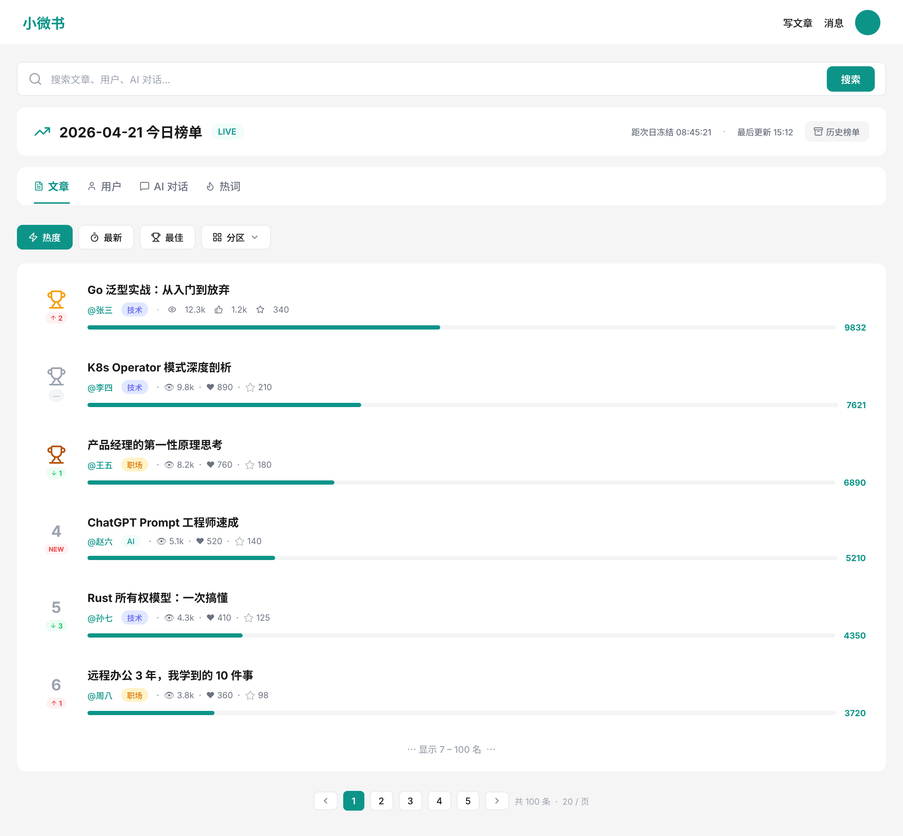
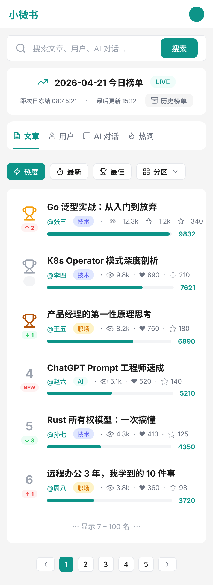

# 榜单模块 PRD（Ranking / Leaderboard）

> 周期：**日榜**（自然日 00:00 ~ 23:59）
> 落地：搜索页 `/search` 默认 Tab
> 原型：`./ranking-search-page.png` · pen 源：`../chat/chat.pen` 顶层 frame `07-榜单-搜索页`（id: `rSwsj`）

---

## 1. 目标与场景

在搜索页提供 **日度 Top100 榜单**，帮助用户发现当天最受欢迎的 **文章 / 用户 / AI 对话 / 搜索词**，提升内容曝光与用户留存。

**核心场景**：用户进入搜索页 → 默认看到榜单 Tab → 切换对象（文章/用户/对话/热词）× 维度（热度/最新/最佳/分区）。未搜索时榜单就是搜索页的默认落地内容。

---

## 2. 用户故事（P0 → P2）

**P0 — 文章榜**
- 作为普通用户，我希望在搜索页看到「今日热门文章 Top100」，以便无搜索意图时也能发现内容
- 作为普通用户，我希望切换「热度 / 最新 / 最佳 / 分区」维度，以便按不同喜好浏览
- 作为普通用户，我希望看到文章在榜单中的排名变化（↑↓─/NEW），以便感知热度趋势
- 作为系统，榜单点击必须写入 `ClickEvent{source: "ranking"}`，回流到下一轮计算

**P1**
- 作为内容创作者，我希望看到「今日热门作者 Top100」，以便发现优质作者关注
- 作为普通用户，我希望看到「今日热门搜索词」，以便了解大家在搜什么
- 作为用户，我希望查看历史日期归档榜单（`/ranking/archive?date=YYYY-MM-DD`）

**P2**
- 作为用户，我希望看到「热门 AI 对话」榜（脱敏的对话标题 + 点击次数），以便获取提示词灵感

---

## 3. 榜单对象 × 维度矩阵

| 对象 \ 维度 | 热度 Hot | 最新 New | 最佳 Best | 分区 Category |
|---|---|---|---|---|
| **文章** | ✅ P0 | ✅ P0 | ✅ P0 | ✅ P0 |
| **用户** | ✅ P1 | — | ✅ P1 | — |
| **AI 对话** | ✅ P2 | — | — | — |
| **搜索词** | ✅ P1 | — | — | — |

**维度定义**（公式细节留给 architect 阶段）：
- **热度 Hot**：综合点击+点赞+收藏+小时级时间衰减，反映"当下最火"
- **最新 New**：当日发布时间倒序，带最低互动门槛过滤
- **最佳 Best**：点赞率 / 收藏率高，反映"质量"而非流量
- **分区 Category**：热度榜按分类切片

---

## 4. 用户流程

```
搜索页 (/search)
  ├─ 默认 Tab: 榜单  [文章|用户|对话|热词]
  │   └─ 子 Tab: [热度|最新|最佳|分区]
  │       └─ Top100 列表 → 点击 → 详情页（记录 ClickEvent{source:"ranking"}）
  ├─ 输入关键词 → 切到搜索结果 Tab
  └─ 分页：分 5 页 × 20
```

**异常/分支**：
- 榜单为空（零点后数据不足）→ 展示"榜单生成中，一会再来"占位
- 接口失败 → Skeleton + 重试按钮
- 未登录可看，点击文章跳详情时走现有 `AuthGuard`

---

## 5. 页面清单

| 页面 | 路由 | 认证 | 关键元素 |
|---|---|---|---|
| 搜索页（含榜单） | `/search` | 公开 | Tab 切换器、榜单列表、搜索框 |
| 榜单归档 | `/ranking/archive?date=2026-04-20` | 公开 | 日期选择器 + 榜单快照 |

---

## 6. 原型

### 6.1 桌面端



**原型关键元素**（与 `.pen` 一一对应）：
- 顶部 Header：logo + 写文章/消息 + 头像
- 搜索框：placeholder "搜索文章、用户、AI 对话…" + 主色搜索按钮
- 日榜标题条：`2026-04-21 今日榜单` + `LIVE` 徽章 + 冻结倒计时 + 最后更新时间 + 历史榜单入口
- 对象 Tab：`📄 文章 | 👤 用户 | 💬 AI 对话 | 🔥 热词`（文章激活，底部 2px 主色下划线）
- 维度 Tab：`🔥 热度 | 🆕 最新 | ⭐ 最佳 | 📁 分区 ▾`（热度激活，填充主色）
- 榜单条目：
  - 1~3 名 🥇🥈🥉 28px 表情；4~100 名普通数字 22px 灰色
  - 趋势徽章：`↑2` 红 / `↓1` 绿 / `─` 灰 / `NEW` 红
  - 标题 16/700 黑 · 作者 12/500 主色 · 分区标签（技术/职场/AI…） · 点击·点赞·收藏元信息 12/400 灰
  - 热度进度条（相对榜首） + 右侧热度分数 12/700 主色
- 省略行 `⋯ 显示 7 – 100 名 ⋯`
- 分页器：`◀ 1 2 3 4 5 ▶ · 共 100 条 · 20/页`

### 6.2 移动端



> pen 源：`../chat/chat.pen` 顶层 frame `08-榜单-移动端`（id: `tVVgY`），宽度 390px，断点 `< md`（`< 768px`）生效。

**移动端关键差异**（相对桌面）：

| 模块 | 桌面 | 移动端 |
|---|---|---|
| Header | logo + 写文章/消息 + 头像（64px 高） | logo + 头像（52px 高，隐藏次级导航） |
| RankHeader | 单行：日期·LIVE 左，倒计时·更新·历史 右 | 两行堆叠：第一行日期·LIVE；第二行倒计时·更新·历史 |
| 日期标题 | 20/700 | 16/700 |
| Object Tabs | 4 个平铺 padding 24 | padding 12，`overflow-x-auto` 横向滚动（中文禁换行） |
| Dimension Tabs | `padding [8,16]` | `padding [6,12]` + `flex-wrap` |
| Item 排名列 | 56px 宽 | 44px 宽 |
| Item 标题 | 16/700 单行 | 14/700 最多 2 行截断 |
| Item meta 行 | 作者·分类·眼·赞·收藏 单行 | 两行：第一行 作者·分类；第二行 眼·赞·收藏 |
| Item padding | `[16,20]` | `[12,12]` |
| Pagination | 完整控件 + 共 N 条 + pageSize 切换 | antd `simple` 模式，隐藏 sizeChanger 与 showTotal |

**滚动条稳定性**：`html { scrollbar-gutter: stable }`（`app/globals.css`），切 tab 总高变化不触发 15-17px 横向抖动。

---

## 7. 边界与约束

| 维度 | 约束 |
|---|---|
| 数据量 | Top100/榜，P0 文章 × 4 维度 = 4 个榜单 × 100 条 |
| 刷新频率 | **热度/最佳**：每 1min 增量重算；**最新**：准实时；**分区**：每 1min |
| 冻结 | **次日 00:10** 归档昨日榜单到 DB，冻结不可变 |
| 性能 | 榜单接口 p99 < 100ms（Redis ZSet 直出） |
| 权限 | 读公开；写（触发重算）仅内部定时任务 |
| 新内容门槛 | 发布满 **15 分钟** 才进入候选，防刷 |
| 防刷 | 同用户 24h 内对同文章的点击/点赞只计 1 次 |
| 时间衰减 | **小时级**，半衰期 6~8h（待 architect 敲定） |
| 冷启动 | 每日前 2 小时数据稀疏 → 继承昨日 Top 作为初始排序，新点击逐步顶上去 |
| 多端 | PC + 移动端响应式 |

---

## 8. 验收标准

**AC1 · 榜单展示**
- Given 当日已累计足够互动数据
- When 用户打开 `/search`
- Then 默认展示「文章·热度」Top100，首屏 20 条，p99 < 200ms

**AC2 · 维度切换**
- Given 用户在榜单页
- When 点击「最佳」Tab
- Then 列表切换为按质量分排序，保留当前对象（文章）

**AC3 · 排名趋势**
- Given 用户 1 分钟后再次查看榜单
- When 某文章从第 5 名升至第 3 名
- Then 该条目显示 `↑2` 红色徽章

**AC4 · 点击追踪**
- Given 用户在榜单点击一篇文章
- When 跳转到详情页
- Then 后端记录 `ClickEvent{source: "ranking", ...}`，回流到下次榜单计算

**AC5 · 日度冻结**
- Given 次日 00:10
- When 定时任务执行归档
- Then 昨日榜单快照入库，`/ranking/archive?date=YYYY-MM-DD` 可查；今日榜单从 0 开始累计

**AC6 · 空榜降级**
- Given 零点后候选文章 < 10 条
- When 用户打开榜单
- Then 展示占位图"榜单生成中"而非空列表

---

## 9. 风险与待讨论（留给 architect）

- **公式选型**：HN 衰减 / Reddit Hot / Wilson 置信区间 / 自定义加权
- **存储**：Redis ZSet（实时） + MySQL（归档） + 可选 ES（分区聚合）
- **冷启动兜底**：首日 / 每日前 2 小时是否继承前一日权重
- **AI 对话上榜**隐私脱敏规则需与业务方确认
- **凌晨切换视觉**：需要"昨日 / 今日"切换控件避免突兀

---

## 10. 文档与原型同步清单

| 产物 | 路径 |
|---|---|
| PRD 文档 | `prd/ranking/PRD.md` |
| 原型 PNG（桌面） | `prd/ranking/ranking-search-page.png` |
| 原型 PNG（移动） | `prd/ranking/ranking-search-page-mobile.png` |
| 原型 pen 源（桌面） | `prd/chat/chat.pen` → 顶层 frame `07-榜单-搜索页`（id: `rSwsj`） |
| 原型 pen 源（移动） | `prd/chat/chat.pen` → 顶层 frame `08-榜单-移动端`（id: `tVVgY`） |
| CHANGELOG 追加 | 待 done 阶段补 |

**同步规则**：pen 原型任何改动必须：
1. 用 Pencil MCP 改 pen
2. 重新 `export_nodes` 覆盖 PNG
3. 同步更新本 PRD 第 6 节描述
4. 缺一不可，否则视为原型未更新
